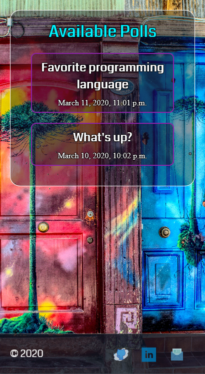
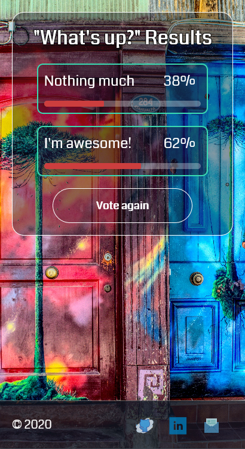

# Django Polls

A polls application where users can vote on questions. Admins and allowed users can add their own polls.

## Setup

Note: This was built using Python 3.7+ and Django 3.0.7.

+ Create virtual environment: `python -m venv <environment_name>`
+ Use virtual environment: `source <environment_path>/Scripts/activate`
+ Install the dependencies: `pip install -r requirements.txt`
+ Edit in your database details in **main/settings.py** under **DATABASES**
+ Run `python manage.py migrate` after setting up the database to create the tables needed.
+ Create a superuser for the project: `python manage.py createsuperuser`
+ Run `python manage.py runserver`
+ Go to "http://localhost:8000" to see the site and "http://localhost:8000/admin" to add poll questions and answers.

## Preview

    
    

